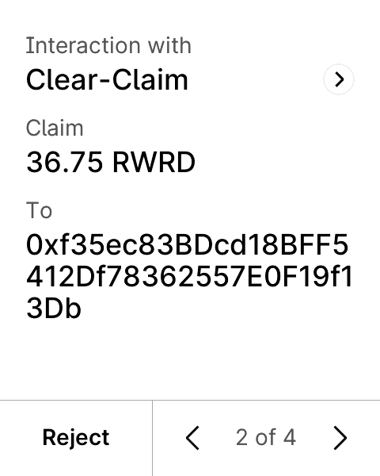

# Clear-Claim

A keyless reward-claim agent for DePIN operators. The agent watches an operator's
claimable rewards and gas, decides when to claim, and assembles the transaction —
but it holds no private key. The operator approves the claim on a Ledger, which
shows a readable line like `Claim 36.75 RWRD to 0x9aF3…` instead of a raw hash,
via an [ERC-7730](https://eips.ethereum.org/EIPS/eip-7730) descriptor.

The point: a hardware gate doesn't protect anyone if the device only shows an
unreadable hash. The approval is only meaningful when the transaction is readable.



```
 Node agent (viem)          Reward contract            Ledger (Speculos)
 ────────────────           ───────────────            ─────────────────
 reads claimable    ──────► DePINRewardDistributor
 + gas price        ◄────── (returns claimable)
 decides + assembles
        │ claim tx
        ▼
 DMK signer (no key) ── clear-signed via ───────────► "Claim 36.75 RWRD
        │               ERC-7730 descriptor             to 0x9aF3…21bC"
        │ broadcast                                     approve on device
        ▼
 EVM testnet (Polygon Amoy / Sepolia)
```

- `contracts/` — Solidity reward distributor (Foundry)
- `descriptor/` — ERC-7730 clear-signing descriptor + validation
- `agent/` — the keyless agent (TypeScript, viem, Ledger DMK)
- `web/` — landing page (Vite + React)

## Requirements

Docker (for the Ledger simulator), Node 20+, and git. No hardware and no key are
needed — signing happens on the emulated device.

## Quickstart (zero setup)

Runs against the live demo contract on Polygon Amoy. The simulator's default seed
derives the same operator everywhere, and the contract's faucet credits it, so
this works without deploying anything.

```bash
# 1. the Ledger simulator (downloads the Ethereum app, runs on :5005)
mkdir -p scripts/apps
curl -sSL -o scripts/apps/ethereum-flex.elf \
  https://github.com/LedgerHQ/app-ethereum/releases/download/1.22.1/app-1.22.1-flex.elf
API_PORT=5005 DEVICE_MODEL=flex scripts/run-speculos.sh

# 2. the agent, pointed at the live contract
cd agent && npm install && cp .env.demo.example .env
cd .. && bash scripts/demo.sh   # runs the agent and approves on the simulator
```

`demo.sh` drives the device for you. To approve it yourself instead, run
`cd agent && npm start`, open http://localhost:5005, drag right-to-left to move
through the review pages, then click and hold "Hold to sign".

## Deploy your own

Works on Sepolia (`CHAIN_ID=11155111`), Polygon Amoy (`80002`), or Arbitrum
Sepolia (`421614`).

```bash
cd contracts
forge test
cp .env.example .env          # DEPLOYER_PRIVATE_KEY (faucet-funded), OPERATOR_ADDRESS
forge script script/Deploy.s.sol --broadcast --legacy \
  --rpc-url https://rpc-amoy.polygon.technology --private-key $DEPLOYER_PRIVATE_KEY
```

Get `OPERATOR_ADDRESS` from `cd agent && npm run whoami`, then put the deployed
addresses in `agent/.env` and run the agent.

## How clear signing works

A production Ledger only renders descriptors signed by Ledger's CAL. For
Speculos/dev, Ledger provides a test-signing flow (the same one their
`clear-signing-tester` uses), which the agent uses automatically: it posts the
ERC-7730 descriptor to `app.devicesdk.ledger-test.com`, then intercepts the DMK's
CAL requests to serve it (`agent/src/vendor/cal-interceptor`). For production
devices the descriptor must be merged into the
[ERC-7730 registry](https://github.com/ethereum/clear-signing-erc7730-registry);
`scripts/submit-descriptor-pr.sh` opens that PR.

## Real hardware

Set `TRANSPORT=usb` in `agent/.env`, plug in a Ledger, open the Ethereum app, and
approve on the device. The readable render requires the registry descriptor; until
then a stock device blind-signs.

## Deployed contracts

Live demo deployment on **Polygon Amoy** (chainId `80002`):

| Contract | Address |
|----------|---------|
| `RewardToken` (RWRD) | [`0x9B60A21F729CC6138E89d84615c1c26b06f31354`](https://amoy.polygonscan.com/address/0x9B60A21F729CC6138E89d84615c1c26b06f31354) |
| `DePINRewardDistributor` | [`0x699B46c34cDd4480E6160FaDcC982D3Bf8E6E6f5`](https://amoy.polygonscan.com/address/0x699B46c34cDd4480E6160FaDcC982D3Bf8E6E6f5) |

Example clear-signed claim, signed on the device and broadcast on-chain:
[`0x6957a89a…`](https://amoy.polygonscan.com/tx/0x6957a89a67c9938cbc77cd5e563f9d6a0f986afe18ef58140a1960872aa3cdfc)

The agent reads WeatherXM's live per-station reward rate (`api.weatherxm.com`) and
claims that amount; the distributor self-credits it on a 60s cooldown so anyone
can run the flow without a key or a deploy. The same `Deploy.s.sol` works on
Sepolia (`11155111`) and Arbitrum Sepolia (`421614`) — set `CHAIN_ID` accordingly.
